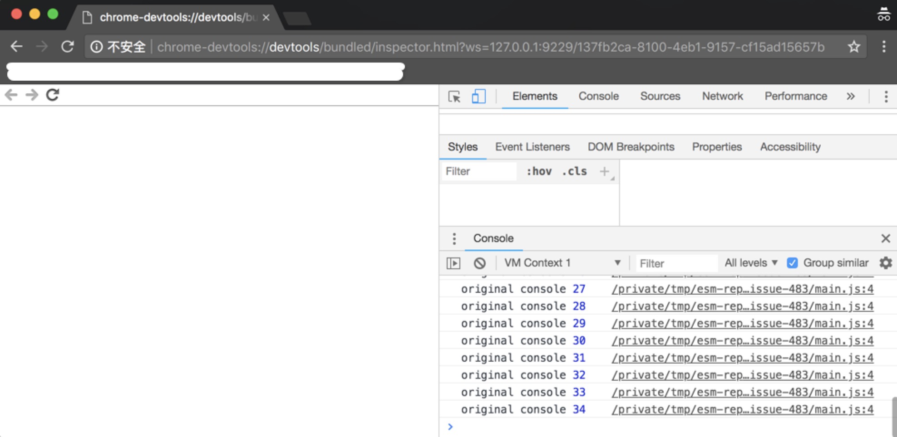

# How to reproduce

```
npm i
# 9229 is the port to listen
node --inspect=9229 index.js
```

There would be outputs in the terminal like

```
Debugger listening on ws://127.0.0.1:9229/137fb2ca-8100-4eb1-9157-cf15ad15657b
For help, see: https://nodejs.org/en/docs/inspector
original console 1
esm console 1
...
```

Then, Copy the part after `ws://`, i.e. `127.0.0.1:9229/137fb2ca-8100-4eb1-9157-cf15ad15657b` in this example

Prepend `chrome-devtools://devtools/bundled/inspector.html?ws=` before it to form the url for debugging

Visit the url using Chrome, i.e. `chrome-devtools://devtools/bundled/inspector.html?ws=127.0.0.1:9229/137fb2ca-8100-4eb1-9157-cf15ad15657b` in this example

Check out **the output in the Console panel** of the developer tools

It's also possible to reproduce the problem using the debugging tools of [VSCode](https://code.visualstudio.com/) with proper configurations, like `Node.js: attach` or `Node.js: Launch Program`

## Expected Output in the Console panel

There should be both `original console` lines and `esm console` lines

```
original console 1
esm console 1
original console 2
esm console 2
original console 3
esm console 3
...
```

## Actual Output in the Console panel

There is only `original console` lines.

Outputs with `console.log(...)` in esm's environment are not shown in the Console panel of the dev tools

```
original console 1
original console 2
original console 3
...
```


